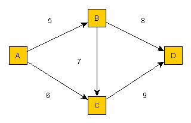

# License Notice
Notice that the "core" library with the API and general code is released with MIT License.
However, the libraries which are implementing adapters are licensed in the same way as the adapted libraries.
Currently there are **five** such adapter libraries, and **if you intend to use one or more of them you must check their licenses**:
* [adapters-shortest-paths-impl-yanqi](https://github.com/TomasJohansson/adapters-shortest-paths/tree/master/adapters-shortest-paths-impl-yanqi)
* [adapters-shortest-paths-impl-bsmock](https://github.com/TomasJohansson/adapters-shortest-paths/tree/master/adapters-shortest-paths-impl-bsmock)
* [adapters-shortest-paths-impl-jgrapht](https://github.com/TomasJohansson/adapters-shortest-paths/tree/master/adapters-shortest-paths-impl-jgrapht)
* [adapters-shortest-paths-impl-mulavito](https://github.com/TomasJohansson/adapters-shortest-paths/tree/master/adapters-shortest-paths-impl-mulavito)
* [adapters-shortest-paths-impl-reneargento](https://github.com/TomasJohansson/adapters-shortest-paths/tree/master/adapters-shortest-paths-impl-reneargento)

Note that only **two** (yanqi and bsmock) of the above five implementation libraries are available from OSSRH ("Maven Central").   

## Information about why only some libraries are deployed to OSSRH ("Maven Central")

Currently only **two** (yanqi and bsmock) of the above five implementation libraries are available from OSSRH ("Maven Central").<br>
The reasons are related to licenses and performance.

If you would decide which project to use then you would likely want to use an implementation producing correct results and as fast as possible.<br>
The test cases indicate that all five implementations produce the same results, which means that correctness is not a relevant factor when deciding which library to use.

If we for a second would ignore the licensing issue, then why not simply only deploy the fastest implementation?<br>
Well, since the project is an adapter it would look weird if someone finds it through a website where you can search for maven projects, and then find this "adapter" project with only one implementation.<br>
Therefore I consider two libraries as a minimum that should be deployed.

Then the two fastest should be deployed?<br>
Well, yes that would be natural if you ignore the licensing issue.<br>
The test cases with big graphs indicate that the "reneargento" implementation is the fastest, and then the second fastest is "yanqi".<br>
The reason for not having deployed "reneargento" is that the license is **probably** less permissive and I do not want to get into trouble.<br>
More information about the license for that adaptee project can be found here:<br>
https://github.com/TomasJohansson/algorithms-sedgewick-wayne

The permissive Apache License is used for both of the two adaptee projects (forks) used by the adapters "yanqi" and "bsmock".

## Adapters for Java implementations of Graph algorithms useful for finding the shortest paths ins travel routing.

The purpose of this project is to provide Adapters for Java implementations finding the shortest path**s** (and note the plural of the word 'path**s**').<br>
This is useful for travel routing  when you want to minimize the total time or total distance.<br>
The project might also be useful for other situations, but travel routing is the main kind of application I have in mind.<br>
Regarding graph theory applicable for finding the shortest paths in travel routing, see more information about that further down in a separate section at this page.
  
**Currently there are five implemented Adapters**, i.e. five different implementations can be used.
Since the Client code is using the same Target interface (see the [Adapter Design Pattern](https://en.wikipedia.org/wiki/Adapter_pattern)) it is possible to **reuse the same test code for the different implementations**.
Therefore you can assert their results against each other, which could help finding bugs. If one implementation would produce a different result than the others, then it is likely a bug that should be reported and hopefully fixed. However, note that the tested graph need to be constructed in such a way that there must not be more than one path (among the first shortest paths you use test assertions for) with the same total weight. If multiple paths have the same total weight then it is not obvious which should be sorted first, and then it would not be surprising if different implementations produce different results.

When you run such tests with the same test data for different implementations then you can also easily **compare the performance for the different implementations**.       

### Example of how to use this shortest paths adapter library:

The Java code example below uses the following graph with four vertices (A,B,C,D) and five edges with weights.<br>(A to B (5) , A to C (6) , B to C (7)  , B to D (8) , C to D (9) ).<br><br>
There are three possible paths from A to D , with the total weight within parenthesis : 
* A to B to D (total cost: 13 = 5 + 8)
* A to C to D (total cost: 15 = 6 + 9)
* A to B to C to D (total cost: 21 = 5 + 7 + 9)

For example, the vertices might represent cities, and the edges might represent roads with distances as weights.

The Java code below can be used for finding the shortest paths (sorted with the shortest first) from A to D :<br>
(and similar code as below can be found in the example project's file [ExampleMain.java](https://github.com/TomasJohansson/adapters-shortest-paths/blob/master/adapters-shortest-paths-example-project/src/main/java/shortest_paths_getting_started_example/ExampleMain.java))

```java
import static com.programmerare.shortestpaths.core.impl.EdgeImpl.createEdge;
import static com.programmerare.shortestpaths.core.impl.GraphImpl.createGraph;
import static com.programmerare.shortestpaths.core.impl.VertexImpl.createVertex;
import static com.programmerare.shortestpaths.core.impl.WeightImpl.createWeight;
import java.util.Arrays;
import java.util.List;
import com.programmerare.shortestpaths.adapter.bsmock.PathFinderFactoryBsmock;
import com.programmerare.shortestpaths.adapter.jgrapht.PathFinderFactoryJgrapht;
import com.programmerare.shortestpaths.adapter.mulavito.PathFinderFactoryMulavito;
import com.programmerare.shortestpaths.adapter.reneargento.PathFinderFactoryReneArgento;
import com.programmerare.shortestpaths.adapter.yanqi.PathFinderFactoryYanQi;
import com.programmerare.shortestpaths.core.api.Edge;
import com.programmerare.shortestpaths.core.api.Graph;
import com.programmerare.shortestpaths.core.api.Path;
import com.programmerare.shortestpaths.core.api.PathFinder;
import com.programmerare.shortestpaths.core.api.PathFinderFactory;
import com.programmerare.shortestpaths.core.api.Vertex;
import com.programmerare.shortestpaths.core.validation.GraphEdgesValidationDesired;
...

	Vertex a = createVertex("A");
	Vertex b = createVertex("B");
	Vertex c = createVertex("C");
	Vertex d = createVertex("D");

	List<Edge> edges = Arrays.asList(
		createEdge(a, b, createWeight(5)),
		createEdge(a, c, createWeight(6)),
		createEdge(b, c, createWeight(7)),
		createEdge(b, d, createWeight(8)),
		createEdge(c, d, createWeight(9))
	);
	
	Graph graph = createGraph(edges, GraphEdgesValidationDesired.YES); 

	// the two first below implementations "YanQi" and "Bsmock" are available from OSSRH ("Maven Central")
	PathFinderFactory pathFinderFactory = new PathFinderFactoryYanQi(); // available from "Maven Central"
	// or: pathFinderFactory = new PathFinderFactoryBsmock(); // available from "Maven Central"
	// or: pathFinderFactory = new PathFinderFactoryJgrapht();  // currently NOT available from "Maven Central" !
	// or: pathFinderFactory = new PathFinderFactoryReneArgento(); // currently NOT available from "Maven Central" !
	// or: pathFinderFactory = new PathFinderFactoryMulavito(); // currently NOT available from "Maven Central" !
	// (currently there are five implementations)

	PathFinder pathFinder = pathFinderFactory.createPathFinder(graph);
	List<Path> shortestPaths = pathFinder.findShortestPaths(a, d, 10); // last parameter is max number to return but in this case there are only 3 possible paths
	for (Path path : shortestPaths) {
		Weight totalWeightForPath = path.getTotalWeightForPath();
		System.out.println(totalWeightForPath);
		List<Edge> pathEdges = path.getEdgesForPath();
		for (Edge edge : pathEdges) {
			Vertex startVertex = edge.getStartVertex();
			Vertex endVertex = edge.getEndVertex();
			Weight edgeWeight = edge.getEdgeWeight();					
			System.out.println(startVertex);
			System.out.println(endVertex);
			System.out.println(edgeWeight);
		}			
	}
}
```
Assuming you are using Maven, to be able to use the above code, you can use the following configuration in your "pom.xml" file :
```xml
<repositories>
	...
	<repository>
		<!-- 
		add this jitpack.io repository as below if you want to use some of the libraries not currently 
		available from "Maven Central" i.e. if you want to use some other library than "YanQi" and "Bsmock" 
		which are the only two currently implementation libraries available att OSSRH ("Maven Central")
		-->	
		<id>jitpack.io</id>
		<url>https://jitpack.io</url>
	</repository>
</repositories>
	
<dependencies>
    ...
	<!--
		You can use the below dependency if you want to use some implementation library not 
		available at OSSRH ("Maven Central") i.e. if you want to use the above repository jitpack.io  
		Note that if you use this dependency below 
		(e.g. because you want to use the "reneargento" implementation since it seems to be the fastest)
		then you are probably restricted to use it only in a context not violating the license GPLv3.
		Further information about the licensing issue:
		https://github.com/TomasJohansson/adapters-shortest-paths/tree/master/adapters-shortest-paths-impl-reneargento
	-->
	<dependency>
		<groupId>com.github.TomasJohansson</groupId>
		<artifactId>adapters-shortest-paths</artifactId>
		<version>7bf0484ca31d17b982abd4a0ec824e945a2e5d50</version> <!--https://github.com/TomasJohansson/adapters-shortest-paths/commits/master  -->
	</dependency>
	<!--
	    An ALTERNATIVE to the above dependency (and then you do neither have to add jitpack.io as above
	    is to use one or both of the below dependencies which 
	    are the ONLY TWO implementation libraries CURRENTLY deployed to OSSRH ("Maven Central")    
    -->
    <dependency>
        <!-- Apache Software License, Version 2.0 -->
        <groupId>com.programmerare.shortest-paths</groupId>
        <artifactId>adapters-shortest-paths-impl-yanqi</artifactId>
        <version>1.0.0</version>
    </dependency>      	
    
    <dependency>
        <!-- Apache Software License, Version 2.0 -->
        <groupId>com.programmerare.shortest-paths</groupId>
        <artifactId>adapters-shortest-paths-impl-bsmock</artifactId>		
        <version>1.0.0</version>
    </dependency>
    
    <!-- the "core" library are also deployed to OSSRH but it should be automatically retrieved when some of the above two dependencies are used -->      			          
</dependencies>
```

### Java version
Java **6** is currently used for compiling the the core library itself, including the Adapter implementations.

However, two of the Adaptee libraries are compiled for Java **8**.
( [JGraphT](https://github.com/jgrapht/jgrapht/blob/master/pom.xml) and [the fork of "reneargento/algorithms-sedgewick-wayne"](https://github.com/TomasJohansson/algorithms-sedgewick-wayne) )  

One of the Adaptee libraries are compiled for Java **7**.
( [MuLaViTo](https://github.com/TomasJohansson/MuLaViTo-fork/blob/45f161312b5e9ec50e2d430d17e8d4a395ce82be/pom.xml) (i.e. the fork of <https://sourceforge.net/p/mulavito/>)

The remaining two Adaptee libraries are actually compiled for Java **5**.
( [the fork of "bsmock/k-shortest-paths"](https://github.com/TomasJohansson/k-shortest-paths) and [the fork of "yan-qi/k-shortest-paths-java-version"](https://github.com/TomasJohansson/k-shortest-paths-java-version) )  
  
This means that if you are using Java 8, then you should be able to use all Adapters, but if you use Java 6 or Java 7 then you are more limited regarding which of the Adapters to use. 
     

### Some comments about the five adaptee libraries currently being used

There are currently Adapter implementations for the following five libraries:
* <https://github.com/jgrapht/jgrapht>
* <https://github.com/yan-qi/k-shortest-paths-java-version>
* <https://github.com/bsmock/k-shortest-paths>
* <https://github.com/reneargento/algorithms-sedgewick-wayne>
* <https://github.com/TomasJohansson/MuLaViTo-fork> (fork based on <https://sourceforge.net/p/mulavito/>)

Regarding the versions/"releases" of the above libraries:

* Regarding jgrapht, the [version 1.1.0](https://github.com/jgrapht/jgrapht/releases/tag/jgrapht-1.1.0) is currently used.         
* Regarding the ["yan-ki"](https://github.com/yan-qi/k-shortest-paths-java-version) implementation, there seems to be no official releases. Also, I could not find a way of reusing the library without modification since it seems to [require input from a file](https://github.com/yan-qi/k-shortest-paths-java-version/issues/4) which would mean I could not have used it as intended, e.g. programmatically creating a big graph for comparison against other implementations. This was one of the reasons why I instead use a [forked version](https://github.com/TomasJohansson/k-shortest-paths-java-version/commits/programmatic-graph-creation-without-using-inputfile). Another reason for creating and using a fork was the limitation that the input vertices needs to be integer in a sequence, while the other libraries support general strings. I fixed this with a mapper class in which maps back and forth from more general input strings.          
* Regarding the ["bsmock"](https://github.com/bsmock/k-shortest-paths) implementation, it was not even a maven project. Therefore I [forked](https://github.com/TomasJohansson/k-shortest-paths/commits/adding-maven-structure-and-junit-test) it and created a maven project of it. I have created a [pull request with my changes](https://github.com/bsmock/k-shortest-paths/pull/2).
* Regarding "reneargento", it was neither a maven project, which was the reason for forking it. It also included a jar file, but the fork is instead using maven and jitpack for defining the dependency in the pom file. Please [read about the license for that dependency](https://github.com/TomasJohansson/algorithms-sedgewick-wayne).
* Regarding "mulavito", it was neither a maven project, which was one of the reason for forking it. It also included unnecessary (for the purpose of just wanting to use the shortest path algorithm) many third-party libraries which have been removed from a branch of the fork.  
	
#### Some concepts in graph theory:

(see the next section further down below regarding how these concepts are relevant when you want to find the shortest paths in travel routing)

"[Vertex](https://en.wikipedia.org/wiki/Vertex_(graph_theory))" = A point or a node in a so called 'Graph'. 'Point' or 'Node' are alternative words sometimes used instead of 'Vertex' . (the plural form of the word 'vertex' is 'vertices')
 
"[Edge](https://en.wikipedia.org/wiki/Edge_(graph_theory))" = Connection between two vertices in a 'Graph'. 'Arc' or 'Line' are alternative words sometimes used instead of 'Edge'. There can also be a direction and/or a weight associated with an edge.

"[Graph](https://en.wikipedia.org/wiki/Graph_(discrete_mathematics))" = Collection of edges (and thus of course the collection also includes vertices since there are normally two vertices in an edge, unless the edge is a loop with the same vertex in both ends of the edge).
 
"[Weight](https://en.wikipedia.org/wiki/Glossary_of_graph_theory_terms#weight)" = Some kind of 'cost' associated with an edge. It can be thought of as the 'cost' of going from the vertex in one end to the vertex in the other end of the edge. Time or distance are examples of weights/costs. When trying to find the shortest path, allowing negative weights tend to make the problem more complicated. The naive approach is that you can simply adjust all weights with a constant big enough to make all weights positive, but then [please look at a counter-example proving it is not that easy](https://www.quora.com/Can-you-add-a-large-constant-to-a-weighted-graph-with-negative-edges-so-that-all-the-weights-become-positive-then-run-Dijkstras-algorithm-starting-at-node-S-and-return-to-the-shortest-path-found-to-node-T-in-order-to-still-get-the-shortest-path). 

"[Path](https://en.wikipedia.org/wiki/Path_(graph_theory))" = Sequence of one or more edges leading from some start vertex to some end vertex. For example, if you have one edge from vertex A to vertex B, and one edge from vertex B to vertex C, then you would have one possible path from A to C by combining those two edges (A to B, and B to C) as a path.

"[Direction](https://en.wikipedia.org/wiki/Directed_graph)" of an edge means that one of the two vertices for the edge is the "start vertex" and the other is the "end vertex".  
When the graph is illustrated in a picture you will normally see an arrow illustrating the direction.

"[Loop](https://en.wikipedia.org/wiki/Loop_(graph_theory))" = Edge connecting a vertex with itself, i.e. the same vertex in both ends of the edge.

"[Cycle](https://en.wikipedia.org/wiki/Cycle_(graph_theory))" = Path where you reach the same vertex again i.e. more than once within the path.

"Vertex-[disjoint](https://en.wikipedia.org/wiki/Glossary_of_graph_theory_terms#disjoint)" paths means that the paths do not have any vertex in common. Vertex-independent is another word for 'Vertex-disjoint'.

"Edge-disjoint" paths means that the paths do not have any edge in common. Edge-independent is another word for 'Edge-disjoint'.  

"[Multi-edge](https://en.wikipedia.org/wiki/Multiple_edges)" means that there are more than one edge connecting the same two vertices (in the same direction if the edges in the graph are directed). 'Parallel edges' or 'Multiple edges' are alternative phrases for 'Multi-edge'. 

### Some words about how graph theory relates to finding the shortest paths when implementing travel routing

"Vertex": You can think of a 'vertex' as a specific geographic location/point which is either an end of the road (dead end/return path) or a place where you have an option about where to go next when you reach that point e.g. at a cross-road.

"Edge": You can think of an 'edge' as a road section between to geographic points ("Vertex" above).

"Graph": You can think of a 'graph' as the road network.

"Weight": You can think of an 'edge weight' as the time or distance for traveling through a road section ('edge' above) . When searching for the shortest paths (i.e. paths with minimal total weights) from one location to another, you may want to minimize the total travel time (although distance can also be an interesting kind of weight). Note that the weight does not necessarily have to be  equal for both directions. For example, if you have defined a graph with walking times between different points when the road section is not flat, then the weight (time) will be larger when you walk steep up compared to walking steep down. The algorithm does **not** need to be able to handle negative weights since time and distance are concepts with positive values.     

"Path": Think of different alternative paths (i.e. paths with the same start vertex and end vertex) as alternative routes. If you have used a GPS (or have made some search with google map regarding traveling between two points) then you have probably seen that you sometimes will see a couple of suggested alternative routes/paths. 

"Direction": Often, but not always (but almost always regarding walking) the roads are bidirectional, i.e. you can walk or go by car in both directions. However, as you know, sometimes you can go by car in only one direction.

"Loops" and "cycles": Of course, you never want to waste time with loops in travel routing, going back to the same place again during the trip. You only want to find meaningful alternative paths, and those should **not** include any loops nor cycles. This is relevant to consider in graph theory. For example, there is an algorithm named "Eppstein" which can find the shortest paths but it does not exclude cycles from the result paths, and therefore is not an appropriate algorithm for travel routing.          

"Vertex-disjoint" and "Edge-disjoint": It is okay if the alternative routes/paths are **partially** the same, i.e. passing trough the same points or road sections. In other words, when an algorithm finds alternative routes/paths, they do **not** have to be disjoint.   

"Multi-edge": The algorithm does **not** need to suport multi-edged paths. It would not make sense to choose some other strategy than simply choosing the edge with the smallest weight (time or distance) between two points.
Of course, if you consider rush hours, it is indeed very common with different travel times between two points, but to handle those situations you can define alternative graphs, i.e. edges with different weights for different times of the day. 
  

One interesting algorithm for "[k shortest paths](https://en.wikipedia.org/wiki/K_shortest_path_routing)" is [Yen's algorithm](https://en.wikipedia.org/wiki/Yen%27s_algorithm).
As mentioned above, Eppstein is not as interesting since it can include cycles.
